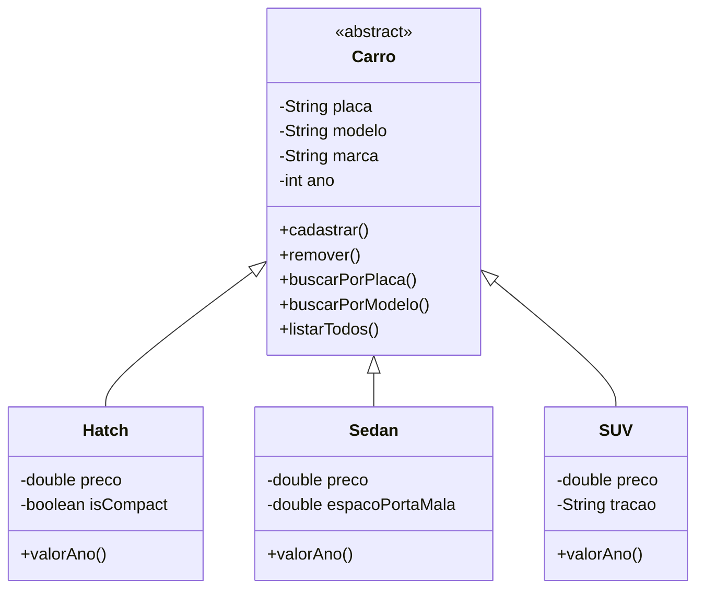

# 🚘 CRUD de Veículos usados em Java - Documentação

## 📚 Visão Geral do Projeto

Este projeto foi desenvolvido para uma entrega na faculdade. Trata-se de um sistema CRUD para gerenciamento de revenda de carros usados, utilizando Java e POO. O sistema permite cadastrar e gerenciar diferentes tipos de veículos (Hatch, Sedan e SUV) e suas características específicas a partir de uma classe abstrata Carro, utilizando Herança e Polimorfismo.

## 🔧 Funcionalidades Principais

Em geral, ao cadastrar recebe como parametro o preço original do carro e utiliza um método especifico para cada carro que calcula uma desvalorização baseada na idade do carro. Como o ano de comparação é o ano que está sendo feito a consulta esse valor vai continuar desvalorizando ao longo do tempo de acordo com quando a cosulta for feita.

### 🚗 Tipos de Veículos Suportados
1. **Hatch**(Maior desvalorização)
   - Atributos específicos: preço e se é compacto
   - Cálculo de desvalorização: 10% (1º ano) → 25% (5º ano) → Teto 40%
   - Exemplo: HB20 2020 (R$60.000) em 2023 vale ≈ R$46.800
2. **Sedan**(Desvalorização moderada) 
   - Atributos específicos: preço e espaço do porta-malas
   - Cálculo de desvalorização: 7% (1º ano) → 20% (5º ano) → Teto 30%
   - Exemplo: Civic 2019 (R$120.000) em 2023 vale ≈ R$96.000

3. **SUV**(Menor desvalorização)
   - Atributos específicos: preço e tipo de tração (4x4 ou 2x4)
   - Cálculo de desvalorização: 5% (1º ano) → 15% (5º ano) → Teto 25%
   - Exemplo: Tiguan 2021 (R$150.000) em 2023 vale ≈ R$142.500

### 📋 Operações CRUD
| Operação | Descrição |
|----------|-----------|
| **Cadastrar** | Adiciona novos veículos ao sistema |
| **Pesquisar** | Busca veículos por placa, modelo, marca ou categoria |
| **Listar** | Exibe todos os veículos cadastrados |
| **Atualizar** | Modifica dados dos veículos existentes |
| **Remover** | Exclui veículos do sistema |

## 🛠️ Estrutura do Código

### 🏗️ Hierarquia de Classes


### 📂 Organização do Projeto
```
📦 CarroCRUD
├── 📂 src
│   ├── 📜 Main.java            # Classe principal com menu interativo
│   ├── 📜 Carro.java           # Classe abstrata base
│   ├── 📜 Hatch.java           # Implementação de veículos Hatch
│   ├── 📜 Sedan.java           # Implementação de veículos Sedan
│   └── 📜 SUV.java             # Implementação de veículos SUV
└── 📜 carros.db               # Arquivo de banco de dados SQLite(em breve)
```

## 💻 Como Executar

1. **Pré-requisitos**:
   - JDK 8+
   - Maven (para gerenciamento de dependências)

2. **Compilação e Execução**:
```bash
mvn compile
mvn exec:java -Dexec.mainClass="Main"
```

## ⚙️ Próximas Melhorias

1. **Persistência em Banco de Dados**:
   - Integração com SQLite para armazenamento persistente
   - Implementação de DAO (Data Access Object)

2. **Sincronização com Nuvem**:
   - Backup automático em serviços como Firebase ou Google Drive

4. **Interface Gráfica**:
   - Migração para Swing

## 📝 Exemplo de Uso

```java
// Cadastrando um Hatch
Hatch gol = new Hatch("ABC1234", "Gol", "Volkswagen", 2020, 45000, true);
gol.cadastrar();

// Calculando valor atualizado
double valorAtual = gol.valorAno();
System.out.println("Valor atual: R$" + valorAtual);

// Buscando veículo
Carro encontrado = Carro.buscarPorPlaca("ABC1234");
```

## 🤝 Contribuição

Contribuições são bem-vindas! Siga os passos:
1. Faça um fork do projeto
2. Crie sua branch (`git checkout -b feature/nova-feature`)
3. Faça commit das alterações (`git commit -m 'Adiciona nova feature'`)
4. Faça push para a branch (`git push origin feature/nova-feature`)
5. Abra um Pull Request
