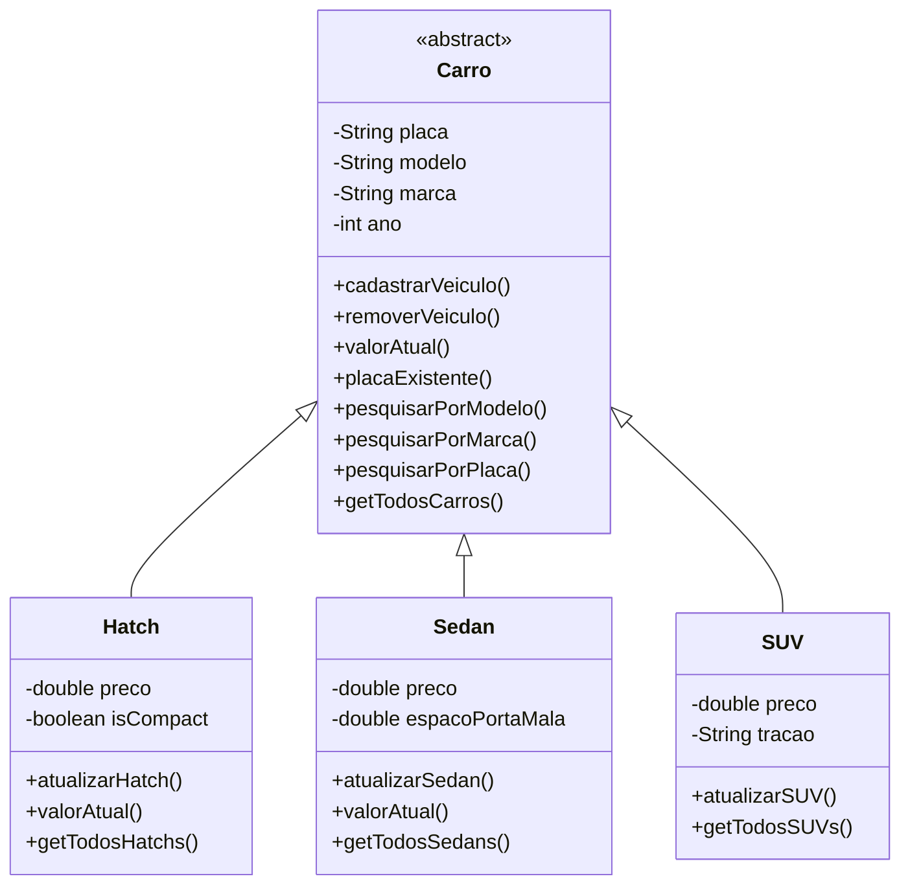

# 🚘 CRUD de Veículos usados em Java - Documentação

## 📚 Visão Geral do Projeto

Este projeto foi desenvolvido para uma entrega na faculdade. Trata-se de um sistema CRUD para gerenciamento de revenda de carros usados, utilizando Java e POO. O sistema permite cadastrar e gerenciar diferentes tipos de veículos (Hatch, Sedan e SUV) e suas características específicas a partir de uma classe abstrata Carro, utilizando Herança e Polimorfismo.

Obs: Faz parte do desafio não utilizar nenhuma biblioteca além das nativas do Java.

## 🔧 Funcionalidades Principais

Em geral, ao cadastrar um carro, o programa recebe como parâmetro o preço original do veículo e utiliza um método especificado a cada categoria de carro calcular uma desvalorização média baseada na idade e quilometragem do veículo. Como o método captura o ano que o usuário está fazendo a consulta em comparativo ao ano do carro, esse valor se torna dinâmico.

### 🚗 Tipos de Veículos Suportados
| Tipo  | Desvalorização Anual | Desvalorização por KM | Máx. Combinado | Atributos Específicos |
|-------|----------------------|-----------------------|----------------|-----------------------|
| Hatch | 3% ao ano            | 0,35% a cada 1.000 km | 60%            | Preço, Compacto       |
| Sedan | 2,6% ao ano          | 0,25% a cada 1.000 km | 50%            | Preço, Porta-malas    |
| SUV   | 2% ao ano            | 0,18% a cada 1.000 km | 40%            | Preço, Tração         |
### 📋 Operações CRUD
| Operação | Descrição |
|----------|-----------|
| **Cadastrar** | Adiciona novos veículos ao sistema, verifica se a placa já está registrada para evitar duplicidade |
| **Pesquisar** | Busca veículos por placa, modelo, marca ou categoria |
| **Listar** | Exibe todos os veículos cadastrados |
| **Atualizar** | Modifica dados dos veículos existentes |
| **Remover** | Exclui veículos do sistema |

## 🛠️ Estrutura do Código

### 🏗️ Hierarquia de Classes


### 📂 Organização do Projeto
```
📦 CarroCRUD
├── 📂 src
│   ├── 📜 Main.java            # Classe principal com menu interativo
│   ├── 📜 Carro.java           # Classe abstrata base
│   ├── 📜 Hatch.java           # Implementação de veículos Hatch
│   ├── 📜 Sedan.java           # Implementação de veículos Sedan
│   └── 📜 SUV.java             # Implementação de veículos SUV
└── 📜 carros.db               # Arquivo de banco de dados SQLite(em breve)
```

## 💻 Como Executar

1. **Pré-requisitos**:
   - JDK 8+
   - Maven (para gerenciamento de dependências)

2. **Compilação e Execução**:
```bash
mvn compile
mvn exec:java -Dexec.mainClass="Main"
```

## ⚙️ Próximas Melhorias

1. **Persistência em Banco de Dados**:
   - Integração com SQLite para armazenamento persistente
   - Implementação de DAO (Data Access Object)

2. **Sincronização com Nuvem**:
   - Backup automático em serviços como Firebase ou Google Drive

4. **Interface Gráfica**:
   - Migração para Swing

### Cálculo de Valor com Quilometragem
```java
SUV compass = new SUV("XYZ9A87", "Compass", "Jeep", 2021, 150000, 30000, "4x4");
double valorAtual = compass.calcularValorAtual(); 
// Considera 2 anos (4%) + 30.000 km (5,4%) → Total 9,4%
// Valor: R$150.000 × 90,6% = R$135.900
```

## 🤝 Contribuição

Para contribuir faça o seguinte:
1. Faça um fork do projeto
2. Crie sua branch (`git checkout -b feature/nova-feature`)
3. Faça commit das alterações (`git commit -m 'Adiciona nova feature'`)
4. Faça push para a branch (`git push origin feature/nova-feature`)
5. Abra um Pull Request
